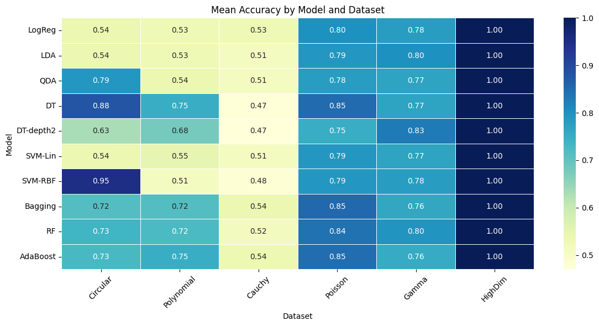

# 🔍 Comparative Analysis of ML Classifiers using Synthetic Datasets

This project explores the **assumptions, strengths, and limitations** of common machine learning classification algorithms by applying them to purposefully designed artificial datasets. The analysis is structured following a didactic and experimental approach and includes metrics, visualizations, and insights into model behavior under different data conditions.

---

## 🎯 Objectives

- Understand **how different classifiers behave** given specific dataset characteristics.
- Visually illustrate **bias-variance tradeoffs**, model flexibility, and overfitting.
- Compare models such as Logistic Regression, LDA, QDA, Decision Trees, SVMs, and Ensemble Methods.
- Evaluate performance across datasets with different **shapes, noise levels, and class separations**.

---

## 📁 Structure & Methodology

The project is divided into several stages:

### 1. Baseline Comparison
- Created a simple, balanced 2D dataset.
- All models performed with nearly perfect accuracy.

### 2. Method Assumptions
- Designed datasets that **fit specific models well** (e.g., circular for SVM RBF, linear for Logistic Regression).
- Applied cross-validation to evaluate generalization.

### 3. Polynomial Decision Boundaries
- Built a 2D dataset from a second-order polynomial function.
- Trees and ensembles performed best.

### 4. Bias-Variance Tradeoff
- Generated multiple datasets (normal, circular, polynomial, uniform).
- Evaluated model behavior as **`ccp_alpha` and noise increased**.
- Produced plots of error decomposition (bias + variance) by pruning level.

### 5. Ensemble Comparison
- Compared Bagging, Random Forest, and AdaBoost across datasets.
- Analyzed **learning curves using OOB error** and CV scores.

### 6. Auxiliary Analysis
- Explored additional datasets with different distributions:
  - Cauchy, Poisson, Gamma, and High-Dimensional
- Summarized all results visually with a heatmap.

---

## 📊 Summary Plot



---

## 📦 Models Compared

- `Logistic Regression`
- `Linear Discriminant Analysis (LDA)`
- `Quadratic Discriminant Analysis (QDA)`
- `Decision Tree (Unpruned and Depth-Limited)`
- `SVM (Linear and RBF Kernel)`
- `Bagging`
- `Random Forest`
- `AdaBoost`

---

## 🧪 Datasets

Artificial datasets were generated using:
- `make_classification`, `make_circles`, `make_moons`, custom polynomial functions, etc.
- Variations in:
  - Class separability
  - Border complexity
  - Noise
  - Class proportions

---

## 🧠 Key Learnings

- No single model performs best under all conditions.
- SVM RBF excels in non-linear boundaries.
- Trees tend to overfit if not pruned.
- Bias-variance tradeoffs depend on both model and data complexity.
- Ensemble methods offer robustness, but are not always superior with high noise or certain structures.

---

## ▶️ How to Run

1. Clone this repository:
   ```bash
   git clone https://github.com/seuusuario/ml-methods-comparison.git

2. Create a virtual environment and install dependencies:

  pip install -r requirements.txt

3. Run the notebook:

   jupyter notebook notebooks/main_analysis.ipynb

